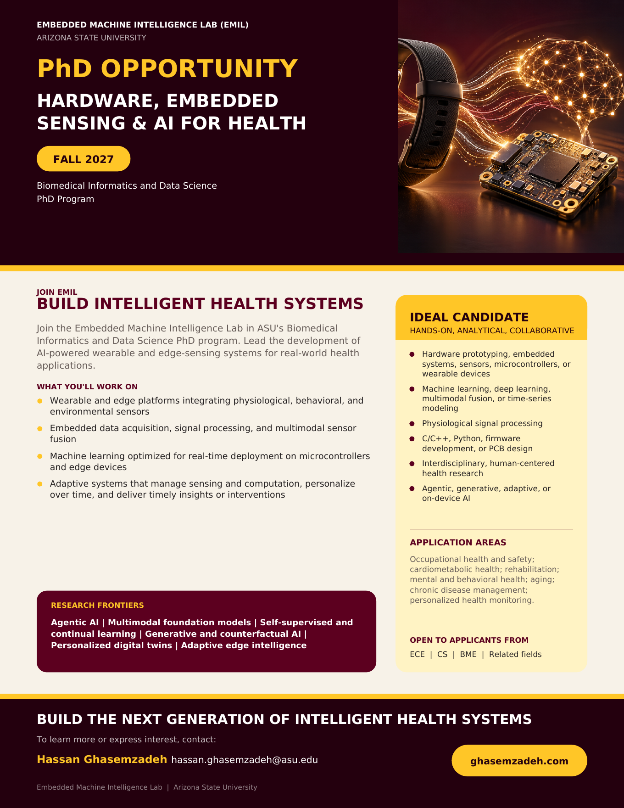

The [Embedded Machine Intelligence Lab (EMIL)](https://ghasemzadeh.com/) at Arizona State University is recruiting a PhD student to join the [Biomedical Informatics and Data Science PhD program](https://degrees.asu.edu/masters-phd/major/ASU00/ESBMIPHD/biomedical-informatics-phd) in Fall 2027.

We seek a hands-on researcher to lead the development of AI-powered hardware prototypes and embedded sensing systems for real-world health applications. The student will design and evaluate wearable and edge-sensing platforms, integrate multimodal physiological, behavioral, and environmental sensors, develop embedded data-acquisition and signal-processing systems, and optimize machine learning models for real-time deployment on edge devices.

The student will explore emerging AI approaches such as agentic AI for autonomous sensing and decision-making, multimodal foundation models, self-supervised and continual learning, generative and counterfactual AI, personalized digital twins, and adaptive edge intelligence. Research may involve systems that reason over continuous sensor streams, dynamically manage sensing and computation, adapt to individual users and changing environments, and deliver timely, personalized health insights or interventions.

These technologies will support a broad range of digital health applications, including occupational health and safety, cardiometabolic health, rehabilitation, mental and behavioral health, aging, chronic disease management, and personalized health monitoring.

Ideal candidates will have strong analytical reasoning and experience or interest in the following areas:

- Hardware prototyping and embedded systems
- Sensors, microcontrollers, and wearable or edge devices
- Machine learning, deep learning, and multimodal sensor fusion
- Physiological signal processing and time-series modeling
- C/C++, Python, firmware development, and PCB design
- Interdisciplinary, human-centered health research
- Agentic, generative, adaptive, or on-device AI

Applicants from electrical and computer engineering, computer science, biomedical engineering, or related fields are encouraged to apply.

**Contact:** Hassan Ghasemzadeh, [hassan.ghasemzadeh@asu.edu](mailto:hassan.ghasemzadeh@asu.edu)

## Flyer

