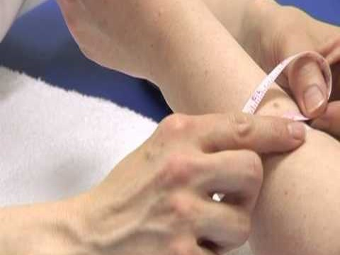

# About the Project

## What is edema? Why is it so important?

Edema is a condition characterized by an excess of watery fluid collecting in the cavities or tissues of the body. Ankle edema is a common symptom in many chronic diseases such as heart failure, liver disease, chronic obstructive pulmonary disease (COPD), heart disease, diabetes, and renal failure. Monitoring Edema helps caregivers and patients to understand the state of the disease as well as the effectiveness of treatments.   

## How is edema being monitored at present?

### Clinical Assessment

During periodic clinical visits, caregivers manually measure the ankle circumference using tap measures or other similar approaches to inspect the changes over time. This method is very expensive on both patients' and health-care system's end. It is also not very accurate since various contextual factors such as level of daily activity and the effect of body posture on formation of edema is being overlooked. Although the formation of edema is a gradual process but it could happen within few days. Therefore these clinical visits have not been very effective in reducing re-hospitalization rate. Remote edema monitoring as a complementary means can reduce the burden of clinical visits and also reduce the number of emergency readmission to hospitals.

### Wireless Weight Scales

Using weight scales at homes, caregivers can watch for sudden changes in weight that could be potentially caused by fluid retention. However studies has shown that this method is not very effective as it has a high false positive rate.

# Related Research Papers

## SmartSock: A Multi-Sensor Wearable for Continuous and Remote Monitoring of Ankle Edema

Embedded and Pervasive Systems Lab is developing an state-of-the-art wearable technology that is capable of accurate and reliable measurement of (1)ankle edema (2)body posture and (3)level of daily activity in real-time and in-home settings. It encompasses several stretch sensors for ankle edema quantification and an accelerometer for body posture and daily activity recognition.\
We have developed a data collection app that will use an opportunistic data transmission approach to collect raw sensor readings from SmartSock. These readings will be filtered/calibrated and then sent to a back-end server for further analysis. Translation of data will be available for caregivers and patients. The preliminary results have been very promising.

The long-term objective of SmartSock is to improve human health and impact healthcare delivery by developing intelligent technologies that aid with health monitoring and intervention. SmartSock is a remote monitoring system that uses wearable sensors to continuously and precisely measure ankle edema and physical activity. We hypothesize that health related outcomes can be improved by more accurately and continuously quantifying symptoms and patient's physical activity functioning using wearable sensors and machine learning software algorithms.

### Competitive Advantages

Table below briefly highlights the advantages of SmartSock technology over existing approaches of monitoring lower limb edema.

### Market Size

The market size is huge. Implementing remote health monitoring solutions can save the health care system and the community billions of dollars each year. Millions of people only in United States are dealing with at least one of the aforementioned chronic diseases and solutions such as SmartSock not only are very cost effective but also enhance their quality of life. Below some of the statistics reported for US is illustrated.

