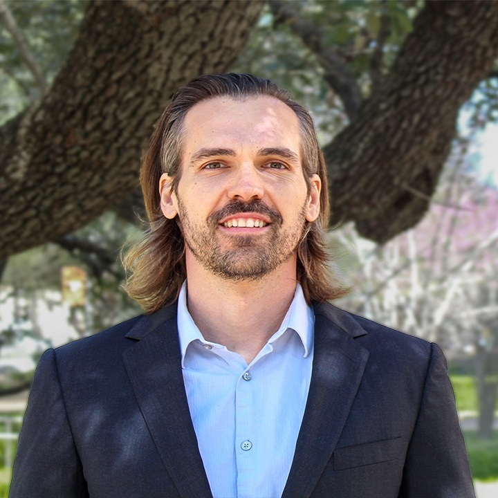
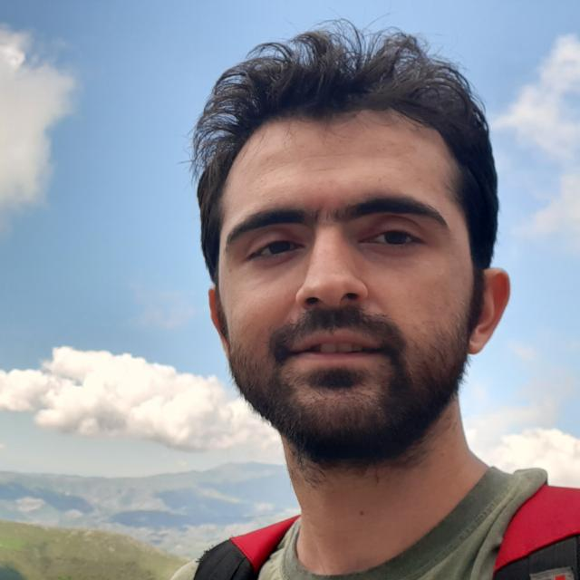

<h2 class="mb-4"></h2>

This ExpandAI project is a partnership between Arizona State University (ASU) and the AI Institute for Foundations in Machine Learning (IFML). ASU, a Hispanic-Serving Institution, leads this new collaboration with an AI Institute to pursue shared, complementary goals to unlock untapped talent at ASU for artificial intelligence (AI) education and use-inspired research. The collaboration focuses on projects that address fundamental challenges of robust/interactive/embedded machine learning in pervasive systems. Pervasive systems integrate computational capability into objects such as wearable technology, mobile devices, and assistive robots as well as built environments such as homes, cars, and workspaces. These technologies are poised to transform health and wellness by addressing the challenges associated with automation of cost-effective, objective, continuous, and real-time monitoring, intervention, and decision making . This partnership in research, education/workforce development, and infrastructure will be centered on addressing challenges in deploying AI-enabled pervasive systems in real-world settings. Because these systems are deployed in highly dynamic environments and in direct interaction with humans, the project will (i) design robust machine learning algorithms that address distribution shifts in the data due to dynamic changes in the system status over time; (ii) design interactive machine learning techniques that incorporate human input and prior domain knowledge for improved model performance and personalized decision making; and (iii) develop embedded machine learning methods for deploying the models on embedded devices with stringent constrained resources. Leveraging the existing AI capacity at ASU and prior research of the collaborators, this partnership between ASU and IFML also increase participation in multidisciplinary research, forging new interdisciplinary collaborative opportunities with the newly founded ASU School of Technology for Public Health and School of Medicine and Advanced Medical Engineering. You can read more about this project <a href="https://www.nsf.gov/awardsearch/showAward?AWD_ID=2402650&HistoricalAwards=false">here</a>.

##### *This material is based upon work supported by the U.S. National Science Foundation (NSF) under Award Number 2402650. Any opinions, findings and conclusions or recommendations expressed in this material do not necessarily reflect the views of the U.S. National Science Foundation.*

<h1>Team</h1>

<h2 class="mb-4">Faculty</h2>

<h2><a href="https://search.asu.edu/profile/4018242">Hassan Zadeh</a></h2>

<h2><a href="https://search.asu.edu/profile/1795222">Pavan Turaga</a></h2>

<h2><a href="https://search.asu.edu/profile/3022467">Giulia Pedrielli</a></h2>

<h2><a href="https://search.asu.edu/profile/29494">Daniel Rivera</a></h2>

<h2><a href="https://www.cs.utexas.edu/people/faculty-researchers/adam-klivans">Adam Klivans</a></h2>

<h2><a href="https://www.cs.utexas.edu/~pstone/">Peter Stone</a></h2>

<h2><a href="https://www.joydeepb.com/">Joydeep Biswas</a></h2>

<h2><a href="https://www.ece.utexas.edu/people/faculty/amy-zhang">Amy Zhang</a></h2>

<h2><a href="https://www.ece.utexas.edu/people/faculty/edison-thomaz">Edison Thomaz</a></h2>

<h2><a href="https://www.cs.utexas.edu/people/faculty-researchers/brad-knox">Brad Knox
</a></h2>

<h2 class="mb-4">Students </h2>

<h2><a href="https://search.asu.edu/profile/4155639">Reza Rahimi</a></h2>

<h2><a href="https://search.asu.edu/profile/4699045">Saman Khamesian</a></h2>

<h2><a href="https://ghasemzadeh.com/authors/eric-junyoung-kim/">Eric Kim</a></h2>

<h2><a href="https://gauthamkrishna-g.github.io/">Gautham Krishna</a></h2>

<h2><a href="https://search.asu.edu/profile/3279834">Mohit Malu</a></h2>

<h2><a href="https://search.asu.edu/profile/4147117">Owen Krueger</a></h2>

<h2><a href="https://search.asu.edu/profile/5039784">Sri Harini</a></h2>

