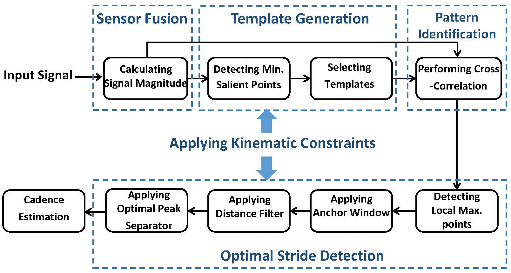

The utility of wearable sensors for continuous gait monitoring has grown substantially, enabling novel applications on mobility assessment in healthcare. Existing approaches for gait cycle detection rely on predefined or experimentally tuned platform parameters and are often platform-specific, parameter-sensitive, and unreliable in noisy environments with constrained generalizability. To address these challenges, we develop algorithms and tools for reliable, platform-independent, and reconfigurable gait cycle detection and step counting. We also study the utility of gait monitoring is various populations.

<!-- ## CyclePro

The utility of wearable sensors for continuous gait monitoring has grown substantially, enabling novel applications on mobility assessment in healthcare. Existing approaches for gait cycle detection rely on predefined or experimentally tuned platform parameters and are often platform-specific, parameter-sensitive, and unreliable in noisy environments with constrained generalizability. To address these challenges, we introduce CyclePro, a novel framework for reliable and platform-independent gait cycle detection. CyclePro offers unique features: (1) It leverages physical properties of human gait to learn model parameters; (2) captured signals are transformed into signal magnitude and processed through a normalized cross-correlation module to compensate for noise and search for repetitive patterns without predefined parameters; and (3) an optimal peak detection algorithm is developed to accurately find strides within the motion sensor data.

## Gait Speed and Survival of Older Cancer Surgical Patients

Gait speed in older patients with cancer is associated with their mortality risk. One approach to assess the gait speed is through the Timed Up and Go (TUG) test. However, performing TUG is personnel-dependent and may be infeasible to perform on every patient as routine care. We utilize machine learning algorithms to automatically predict the result of the TUG test and its association with survival using patient-generated responses. In this research, we propose to learn a decision tree classifier based on functional status, obtained from preoperative geriatric assessment, and TUG test performance of older patients with cancer. The functional status data are used as input features to the decision tree and the actual TUG data are used as ground truth labels. The decision tree is then constructed to assign each patient one of the three categories: “TUG less than ten seconds”, “TUG more than ten seconds”, and “uncertain.” We demonstrate that machine learning algorithms can be trained to accurately predict the gait speed of older patients with cancer based on their response to questions addressing other aspects of functional status.

## Gait Pattern Examination in Glaucoma Patients

This research presents a wearable wireless sensor system designed for real-time gait pattern analysis in glaucoma patients. Many clinical studies have reported that glaucoma patients experienced mobility issues such as walking slowly and bumping into obstacles frequently. The gait attributes of glaucoma patients, however, have not been studied in the literature. We design and develop a shoe-integrated sensing system for objective bio-information collection, utilize signal processing algorithms for feature estimation and leverage machine learning as well as statistical analysis approaches for gait pattern examination. The developed sensor platform is utilized in a randomized clinical trial with 19 participants. We develop signal processing and machine learning algorithms to provide a quantitative comparison between gait characteristics in older adults with and without glaucoma. Our results demonstrate that machine learning algorithms achieve an accuracy of over 80% in distinguishing extracted gait features of those with glaucoma from healthy individuals.

## How Accurate is Your Activity Tracker?

As commercially available activity trackers are being utilized for step counting in clinical trials, the research community remains uncertain about reliability of the trackers, particularly in studies that involve aided walking and in those involving low-intensity activities (i.e., a metabolic equivalent of task < 3). While these trackers have been tested for reliability during normal walking and running, there has been limited research on validating these trackers during low-intensity activities and walking with assistive tools. The aim of this study is threefold: (1) To determine the accuracy of three Fitbit devices (i.e., Zip, One, and Flex) at different wearing positions (i.e., pants pocket, chest, and wrist) during walking at three different speeds including 2.5 km/h, 5 km/h, and 8 km/h performed by healthy adults during treadmill walking; (2) To determine the accuracy of the Fitbit trackers (Zip, One, and Flex) worn at different sites (pants pocket, chest, and wrist) during real-life activities including walking with a shopping cart, walking with a walker, and eating; and (3) To examine whether intensity of physical activities impacts the choice of optimal wearing site of the tracker.

## Glaucoma-Specific Gait Pattern Assessment Using Body-Worn Sensors

Many studies have reported that glaucoma patients experience mobility issues such as walking slowly and bumping into obstacles frequently. However, little is known to date about how a person’s gait is impacted due to glaucoma. This research presents signal processing and machine learning algorithms to automatically detect effective gait cycles and extract both steady-state and spatio-temporal gait features from the signal segments. We perform machine learning algorithms to distinguish glaucoma patients from healthy controls, and identify several prominent features with high discriminability between the two groups. The results demonstrate that classification algorithms can be used to identify gait patterns of glaucoma patients with an accuracy higher than 94% in a 10-meter-walk test. It is also demonstrated that gait features such as evenness of the sway speed along medio-lateral direction between the two feet are significantly different (p-value < 0.001) between older adults with and without glaucoma. -->
