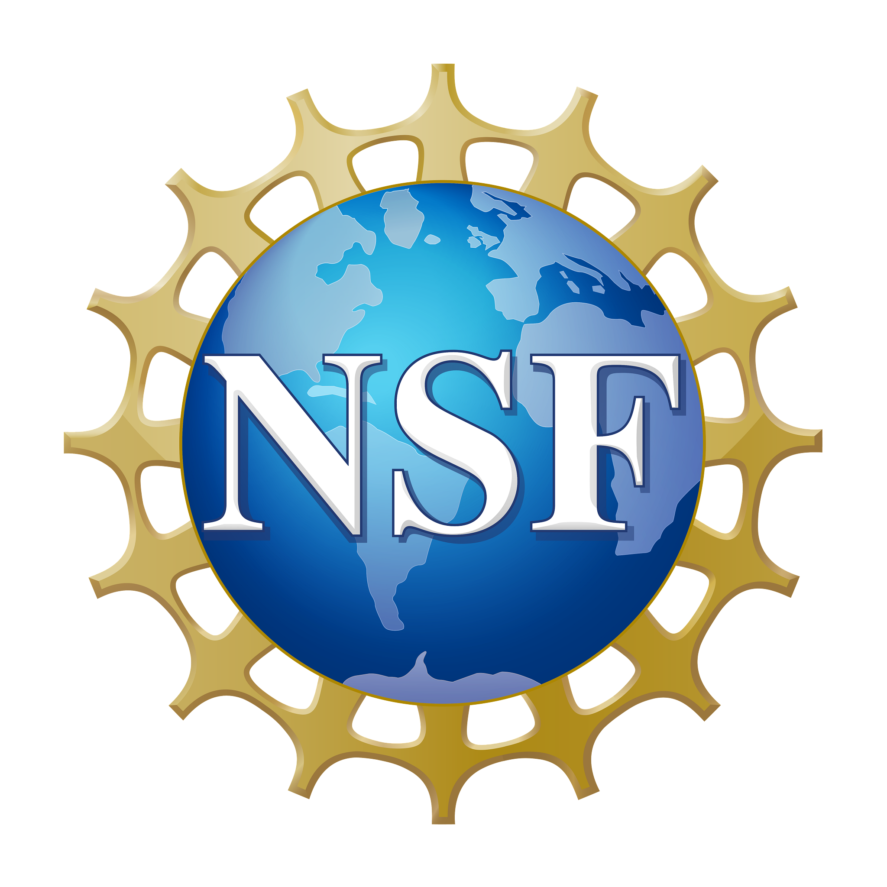

<!-- 
<h2 class="mb-4"></h2>
 -->
Firefighters are faced with myriad stressors from hazardous work conditions and exposure to extreme heat that place their health at significant risks. The intense heat, smoke, shift work, long working hours, and stressful work put firefighters at substantial risk for heat-related injuries, long-term chronic complications, and mental health challenges. The health risks are further compounded in the Phoenix metropolitan, which has one of the highest heat indexes in the nation. Therefore, there is a need to develop technologies to objectively assess the impacts of extreme heat and harsh working conditions on firefighters’ health and to provide actionable information to mitigate the health risks. This project develops HeatMind, an AI-powered sensor-based platform that provides firefighters and community organizations with the tools to objectively monitor heat-related health and provide intervention strategies to minimize risks. The project brings together researchers with expertise in AI, pervasive computing, social and behavioral science, user-centered design, community engagement, heat resilience, and hydration science to collaborate with community partners including firefighters, fire and forestry departments, and nonprofit organizations. The project aims to improve the physical and mental health of firefighters, reduce healthcare costs, improve performance, and enhance job satisfaction and efficiency. The developed technologies can be further refined for use in other communities, such as construction workers, miners, and agricultural workers, who experience prolonged heat exposure.

This interdisciplinary project will design a scalable and adaptable infrastructure for continuous and objective heat-related health monitoring and proactive decision making by developing new methods for community engagement, passive monitoring of key aspects of heat-related health, real-time risk mitigation, and sustaining engagement in digital platforms. Specifically, the project will (1) establish a structured community engagement approach, called Design Studios for Health, where each design studio session will focus on collaborative discussions, prototype testing, and structured feedback collection from firefighters and community partners; (2) design deep learning algorithms that use multimodal wearable sensor data to continuously assess firefighters’ health; (3) develop AI methods that identify mitigation strategies to minimize firefighters’ health risks by generating counterfactual explanations that reason about the machine learning predictions and provide counterfactual feedback to avert impending high-risk events; (4) develop new techniques to ensure robust inference of the AI algorithms so that the HeatMind platform can be reliably deployed in uncontrolled settings and across different environments; and (5) implement a community-facing testbed that integrates sensors, data, and algorithms in a unified framework for data collection, visualization, inference, and intervention delivery.

##### *This material is based upon work supported by the U.S. National Science Foundation (NSF) under Award Number 2531465. Any opinions, findings and conclusions or recommendations expressed in this material do not necessarily reflect the views of the U.S. National Science Foundation.*

<h1>Team</h1>

<h2 class="mb-4">Faculty</h2>

<h2><a href="https://search.asu.edu/profile/4018242">Hassan Zadeh</a></h2>

<h2><a href="https://search.asu.edu/profile/1783317">
Matthew Buman</a></h2>

<h2><a href="https://search.asu.edu/profile/4872722">
Stephanie Carpenter</a></h2>

<h2><a href="https://search.asu.edu/profile/3166703">
Floris Wardenaar</a></h2>

<h2><a href="https://search.asu.edu/profile/3335553">
Stavros Kavouras</a></h2>

<h2><a href="https://search.asu.edu/profile/1795222">Pavan Turaga</a></h2>

<h2><a href="https://search.asu.edu/profile/3817853">Maissa Khatib</a></h2>

<h2 class="mb-4">Students </h2>

<h2><a href="https://search.asu.edu/profile/4754067">Shovito Barua Soumma</a></h2>

