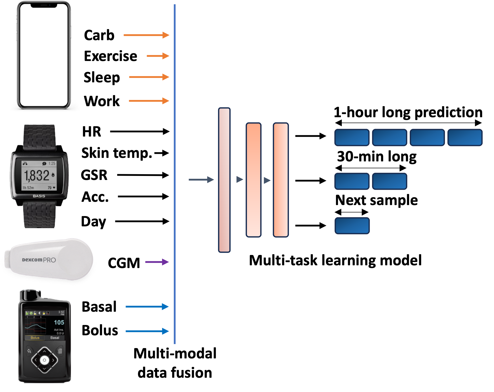

Metabolic health refers to the balance and optimal functioning of the body's metabolic processes, including glucose regulation, lipid metabolism, and energy utilization. With the rise of chronic diseases like diabetes, AI-driven technologies have become crucial tools for diabetes management. These technologies leverage data science and artificial intelligence to analyze large volumes of patient data, such as continuous glucose monitoring (CGM) data, to provide personalized insights and interventions.

CGM data, collected through wearable devices (like Dexcom, Abbott's FreeStyle Libre, Medtronic etc.), offers real-time monitoring of a patient's blood glucose levels. AI algorithms process this data to generate actionable insights, helping individuals make informed decisions about their diet, medication, and physical activity. By analyzing patterns and trends in CGM data, AI-driven systems can provide predictive alerts for potential hyperglycemic or hypoglycemic events, enabling users to take proactive measures.

The integration of AI into diabetes management not only enhances individual control over glucose levels but also facilitates healthcare professionals' ability to provide targeted interventions. As AI technologies continue to evolve, they hold the promise of revolutionizing the way we approach metabolic health, leading to more effective and personalized strategies for diabetes management.  

# Related Research Papers:

## GlySim: Modeling and Simulating Glycemic Response for Behavioral Lifestyle Interventions

Effective prevention and management of diabetes relies on maintaining a normal blood glucose level, thus avoiding abnormal events such as hyperglycemia and hypoglycemia. Predicting anomalous events beforehand can potentially help patients and caregivers intervene to prevent such events through modifiable behaviors such as exercise, diet, and medication. Although Continuous Glucose Monitor (CGM) sensors have been used to monitor and forecast blood glucose level, current research lacks a computational approach that recommends a behavioral intervention to bring the glucose level to a normal range. To address this shortcoming, we present GlySim, a CGM simulator that uses multimodal data to not only forecast future glucose readings but also enable a user to examine the impacts of behavior change on glucose response in advance. GlySim creates opportunities for change in food consumption, medication, and physical activity to avoid dysglycemia by pinpointing factors that cause anomalous events using Grad-CAM (Gradient-weighted Class Activation Mapping) and allowing users to observe how adjusting a behavioral factor changes glucose trajectories. We validate GlySim on a dataset of 10 patients with type 1 diabetes and achieve an overall mean absolute error (MAE) as low as 16.5 mg/dl in simulating glycemic response. Furthermore, Glysim detects hyperglycemic events with 0.89 average precision.

